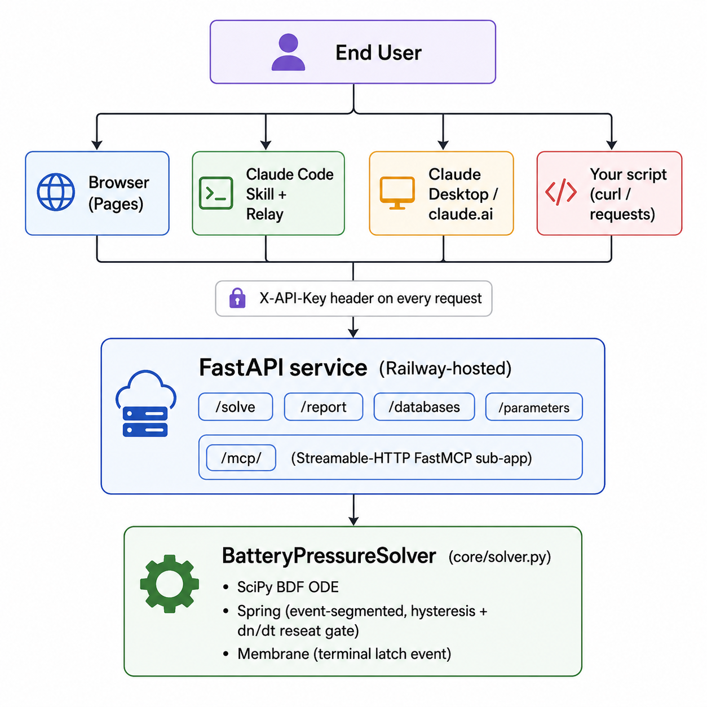
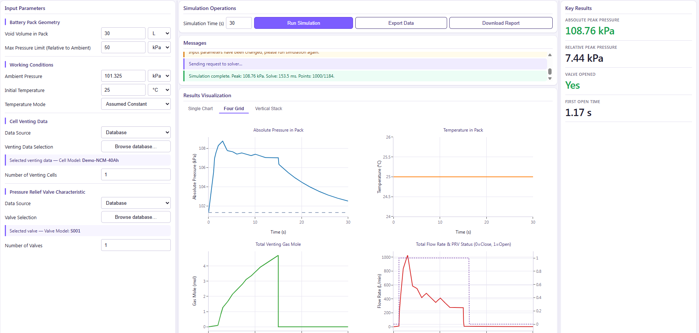

<div align="right">
  <strong>English</strong> · <a href="README.zh-CN.md">简体中文</a>
</div>

<h1 align="center">btms-prv-sizing</h1>

<p align="center">
  <em>Thermal-runaway pressure simulation &amp; pressure-relief-valve (PRV) sizing for battery packs.</em>
</p>

<p align="center">
  
  
  
  
</p>

<p align="center">
  <!-- TODO: hero screenshot — see references/img/hero.png -->
  
</p>

`btms-prv-sizing` lets battery-thermal engineers explore **how internal pack
pressure rises during a thermal-runaway event** and **whether a chosen PRV is
sized correctly** — through a browser GUI, a Claude Code skill, or a remote
MCP connector.

The compute core is a **lumped-parameter pack-pressure ODE** integrated with
SciPy's BDF solver, fed by tabulated single-cell venting curves and tabulated
valve pressure–flow curves. The same backend powers all three frontends.

---

## Table of Contents

1. [Overview](#1-overview)
2. [Architecture](#2-architecture)
3. [Quick Start by User Type](#3-quick-start-by-user-type)
4. [Browser GUI (zero install)](#4-browser-gui-zero-install)
5. [Claude Code Skill](#5-claude-code-skill)
6. [Claude Desktop &amp; claude.ai](#6-claude-desktop--claudeai)
7. [REST API Reference](#7-rest-api-reference)
8. [⚠️ DEMO Data Disclaimer](#8--demo-data-disclaimer)
9. [Bring-Your-Own Data (BYO)](#9-bring-your-own-data-byo)
10. [Getting an API Key](#10-getting-an-api-key)
11. [Repository Layout](#11-repository-layout)
12. [Troubleshooting](#12-troubleshooting)
13. [FAQ](#13-faq)
14. [Contributing](#14-contributing)
15. [License](#15-license)
16. [Contact](#16-contact)

---

## 1. Overview

When a lithium-ion cell goes into thermal runaway, it vents hot gas into the
pack. If the pack cannot relieve that pressure fast enough, structural
deformation, propagation to neighbouring cells, or enclosure rupture can
follow. **PRV (pressure-relief-valve) sizing** is the engineering exercise of
picking a valve — opening pressure, flow capacity, and quantity — such that
the peak internal pressure stays comfortably below the pack's structural
limit during a worst-case venting scenario.

This project provides:

- **A web GUI** for interactive exploration (Plotly charts, CSV/PDF export).
- **A Claude Code skill** that drives the GUI for you, watches the result,
  and writes the engineering analysis straight into chat.
- **A remote MCP connector** that exposes the solver as a tool for
  Claude Desktop, claude.ai, and any MCP-aware client.

**Physics model.** Lumped-parameter ideal-gas pack volume with two valve
types:

| Valve type | Behaviour |
|---|---|
| **Spring** | Reversible. Opens at `p_open`, reseats at `p_open − hysteresis` (5 % of opening delta, ≥ 500 Pa). Pressure-segmented BDF with event detection + a `dn/dt` reseat gate to suppress chatter under high gas injection. |
| **Membrane** | Irreversible. Once opening pressure is crossed, the valve latches open and uses the after-curve for the remainder of the simulation. |

**Where this is useful**: early-stage PRV concept selection, sensitivity
analysis (more valves? higher opening pressure?), and Claude-driven
"what-if" sweeps on parameters.

**Where this is _not_ useful**: final compliance certification (use validated
CFD + cell-vent test data), or any decision that exposes humans or property
to risk without independent verification.

> ⚠️ All bundled cell/valve data is demonstration-only — see
> [§8 DEMO Data Disclaimer](#8--demo-data-disclaimer) before any real
> engineering decision.

---

## 2. Architecture

<p align="center">
  
</p>

End users reach the FastAPI backend through four front-ends — the Browser
GUI, the Claude Code Skill + local relay, Claude Desktop / claude.ai, or any
HTTP client — all carrying the same `X-API-Key` header. The backend exposes
both the conventional REST surface (`/solve`, `/report`, `/databases`,
`/parameters`) and a Streamable-HTTP FastMCP sub-app at `/mcp/`, and
delegates the actual integration to `BatteryPressureSolver` (SciPy BDF ODE
with event-segmented Spring or terminal-latch Membrane valve dynamics).

The backend lives in a **private repo**; this `skill/` directory is the
public client + skill bundle.

---

## 3. Quick Start by User Type

| If you are… | Use… | Jump to |
|---|---|---|
| 👤 An engineer who just wants to click and see results | **Browser GUI** | [§4](#4-browser-gui-zero-install) |
| 💻 A Claude Code (CLI / IDE) user | **Claude Code Skill** | [§5](#5-claude-code-skill) |
| 🖥️ A Claude Desktop user | **Skill upload + Connector** | [§6](#6-claude-desktop--claudeai) |
| 🌐 A claude.ai Pro / Max / Team user | **Skill upload + Connector** | [§6](#6-claude-desktop--claudeai) |
| 🛠️ Integrating the solver into your own pipeline | **REST API** | [§7](#7-rest-api-reference) |

All five routes share the **same backend API** and the **same API key** — pick
whichever fits your workflow.

---

## 4. Browser GUI (zero install)

<p align="center">
  
</p>

The fastest way to try the tool. **No install, no dependencies, runs entirely
in your browser.**

> 🌐 **Hosted demo:** [thermalmaverick.github.io/btms-prv-sizing-skill](https://thermalmaverick.github.io/btms-prv-sizing-skill/)

<p align="center">
  <!-- TODO: screenshot — see references/img/gui-config.png -->
  
</p>

### Step-by-step

1. **Open the link** above in any modern browser (Chrome, Edge, Firefox, Safari).
2. **Configure the connection** in the top bar:
   - **API Endpoint** — `https://btms-prv-sizing.up.railway.app`
   - **X-API-Key** — paste your key (see [§10](#10-getting-an-api-key) — the
     trial key is `usertempkey001`)

   Both values are saved in your browser's `localStorage` and pre-filled on
   the next visit.
3. **Pick a cell and a valve** from the two dropdowns on the left panel. The
   list is fetched live from `GET /databases/cells` and `GET /databases/valves`.
4. **Set simulation parameters**: pack void volume, ambient pressure, cell
   count, valve count, simulation time, temperature mode.
5. **Click ▶ Run.** A solve takes 100–800 ms depending on inputs; the four
   KPI cards (peak pressure, relative peak, valve opened, first-open time)
   update along with the chart panel.

### Charts (three modes)

<p align="center">
  <!-- TODO: screenshot — see references/img/gui-charts.png -->
  
</p>

| Mode | What you see |
|---|---|
| **Single** | One trace at a time — Pressure, Temperature, Gas Mole, or Valve Flow & Status |
| **Grid (2×2)** | All four traces side-by-side for at-a-glance comparison |
| **Vstack** | All four stacked vertically with a shared X-axis |

### Export

<p align="center">
  <!-- TODO: screenshot — see references/img/gui-export.png -->
  
</p>

- **CSV** — full time-series dump (time, pressure, temperature, moles, valve
  status, flow rate).
- **PDF** — a multi-page engineering report with the KPI summary, parameter
  table, and embedded charts. Generated server-side via ReportLab +
  Matplotlib in a thread-pool worker.

---

## 5. Claude Code Skill

The richest experience: Claude opens the browser for you, watches every
▶ Run, and writes the engineering analysis directly in chat. No copy-paste.

> 🛠️ **Requires:** Claude Code CLI (terminal or IDE extension).

<p align="center">
  <!-- TODO: screenshot — see references/img/claude-code-skill.png -->
  
</p>

### Install

```bash
# Linux / macOS
git clone https://github.com/ThermalMaverick/btms-prv-sizing-skill \
          ~/.claude/skills/btms-prv-sizing
```

```powershell
# Windows
git clone https://github.com/ThermalMaverick/btms-prv-sizing-skill `
          "$env:USERPROFILE\.claude\skills\btms-prv-sizing"
```

> ⚠️ Layout matters. The final tree must look like
> `~/.claude/skills/btms-prv-sizing/SKILL.md` — no nested folder, no rename.

### Trigger

Talk naturally in any conversation:

> "Help me size a PRV for a 30 L pack, 1 cell venting, simulate for 60 s."

Or invoke explicitly:

```
/btms-prv-sizing
```

Claude will:

1. Detect your runtime (Claude Code CLI / Desktop / web).
2. Decide whether to open the GUI or call MCP directly — based on what you
   asked for.
3. If GUI: ask for your API endpoint + key + relay port, launch the relay,
   open the browser, wait for ▶ Run, then post the result back.
4. If MCP: convert your units (L → m³, °C → K, kPa → Pa), build a
   confirmation table, wait for your "OK", and call `prv_solve`.

The full routing logic lives in [`SKILL.md`](SKILL.md), with detailed
procedures in [`references/playbook.md`](references/playbook.md).

### Optional: bolt on HTTP MCP

If you want Claude Code to also call `prv_solve` directly (handy for sweeps),
create `.mcp.json` in your project root:

```json
{
  "mcpServers": {
    "btms-prv-sizing": {
      "type": "http",
      "url": "https://btms-prv-sizing.up.railway.app/mcp/",
      "headers": { "X-API-Key": "usertempkey001" }
    }
  }
}
```

> The trailing slash on `/mcp/` is required — some MCP clients do not follow
> the 307 redirect.

---

## 6. Claude Desktop &amp; claude.ai

Claude Desktop and the claude.ai web app share **the same Customize UI**
since the late-2025 redesign. The instructions below apply to both.

There are **two complementary integration methods**:

| | **Method A — Upload as Skill** | **Method B — Add as Connector** |
|---|---|---|
| **You get** | Claude reads `SKILL.md` and follows the playbook (unit conversion, confirmation table, analysis template) | The raw MCP tools (`prv_solve`, `prv_databases`, `prv_parameters`) appear in the tool picker |
| **Plan required** | **All plans** (Free, Pro, Max, Team, Enterprise) | **Pro / Max / Team / Enterprise** (not available on Free) |
| **Best for** | Chat-driven "guide me through this" experience | "I know my parameters, just compute" |
| **GUI / file export** | Not available — Desktop & claude.ai have no shell | Not available |

> 💡 **Best practice: install both.** The Skill provides the playbook and
> ambiguity-guards; the Connector provides the solver tools the Skill
> ultimately calls. They work together transparently.

### 6.1 Prerequisites

- **Claude Desktop:** version with the Customize menu (2025-Q4 or newer).
- **claude.ai:** account on Pro, Max, Team, or Enterprise plan (Free plan
  cannot add custom Connectors).
- An API key — see [§10](#10-getting-an-api-key).

### 6.2 Method A — Upload as Skill

<p align="center">
  <!-- TODO: screenshot — see references/img/claude-ai-customize-skills.png -->
  
</p>

1. **Download a ZIP** of this repo (Code → Download ZIP), or build one from
   a fresh clone:

   ```bash
   git clone https://github.com/ThermalMaverick/btms-prv-sizing-skill
   cd btms-prv-sizing-skill
   zip -r btms-prv-sizing.zip . -x ".git/*"
   ```

   The ZIP root must contain `SKILL.md` at top level. If your archiver
   nested everything under a `btms-prv-sizing-skill/` folder, re-zip from
   _inside_ that folder.

2. **In Claude Desktop or claude.ai**, click your avatar → **Customize → Skills**.
3. Click **+ Create skill → Upload a skill**, then pick the ZIP.
4. The skill appears in your list — toggle it **on**.

That's it. Start a new conversation and say "help me size a PRV"; Claude
will follow `SKILL.md`'s playbook.

### 6.3 Method B — Add as Connector

<p align="center">
  
</p>

#### Pro / Max plans (per-user setup)

1. Click your avatar → **Customize → Connectors**.
2. Click **+** → **Add custom connector**.
3. Fill in:
   - **Server URL:** `https://btms-prv-sizing.up.railway.app/mcp/?api_key=usertempkey001`
     (trailing slash before `?` is required; the API key is passed as a
     URL query parameter because claude.ai's dialog has no custom-header field)
   - **OAuth Client ID / Secret:** **leave both fields empty**
     (filling them triggers an OAuth flow this server does not implement,
     and you will get `{"detail":"Not Found"}` on every connect attempt)
4. Click **Save**.
5. Verify: start a new chat → click **+** at the bottom-left → **Connectors**.
   Toggle `btms-prv-sizing` on; the three tools (`prv_solve`,
   `prv_databases`, `prv_parameters`) become available.

> 💡 **If a connect attempt fails, the failure is sticky.** claude.ai
> caches the OAuth state from a failed attempt, so simply re-saving the
> connector keeps failing. To recover: delete the connector entirely,
> close all claude.ai tabs (or restart the Claude app), then recreate it
> from scratch with the URL above and OAuth fields empty.

#### Team / Enterprise plans (org-level setup)

1. An **Owner** opens **Organization Settings → Connectors → Add → Custom → Web**.
2. Fills in the same URL (with `?api_key=...`) and leaves OAuth fields empty, then publishes.
3. Each member then connects individually via the per-user steps above.

### 6.4 Recommended Combo

Install **both** Method A and Method B:

- The **Skill** loads `SKILL.md` and provides the chat-driven playbook —
  unit conversion, the confirmation table, the engineering analysis
  template.
- The **Connector** exposes the actual `prv_solve` tool the Skill calls.

Without the Connector, the Skill cannot run a simulation (it has no
solver). Without the Skill, you have raw tools but no guidance.

### 6.5 Limitations on Desktop / claude.ai

Neither environment has shell access or a writeable local filesystem, so:

- ❌ **No interactive GUI / Plotly charts.** Results return as a Markdown
  table.
- ❌ **No CSV / PDF download.** The `/report` endpoint cannot stream a binary
  PDF into a chat attachment in these clients.
- ❌ **No local relay.** Skill paths that depend on `local_relay.py` are
  automatically disabled (the Skill detects `runtime = "headless"`).

If you need any of these, go back to **[§4 Browser GUI](#4-browser-gui-zero-install)**
or **[§5 Claude Code Skill](#5-claude-code-skill)**.

---

## 7. REST API Reference

> 🔌 **Base URL:** `https://btms-prv-sizing.up.railway.app`
> 🔑 **Auth:** every endpoint **except** `/health`, `/ready`, and
> `/local-result-schema` requires an `X-API-Key` header (e.g.
> `X-API-Key: usertempkey001`).

### Endpoints

| Method | Path | Auth | Purpose |
|---|---|---|---|
| `GET` | `/health` | — | Liveness (process is up) |
| `GET` | `/ready` | — | Readiness (databases loaded, MCP status) |
| `GET` | `/parameters` | ✓ | Solver input schema: SI bounds, defaults, display units |
| `GET` | `/local-result-schema` | — | JSON Schema for `last_result.json` (relay → Claude contract) |
| `GET` | `/databases/cells` | ✓ | List built-in cell entries (incl. full venting curves) |
| `GET` | `/databases/valves` | ✓ | List built-in valve entries (incl. full P-Q curves) |
| `POST` | `/solve` | ✓ | Run a simulation, return KPI + downsampled time-series |
| `POST` | `/report` | ✓ | Run a simulation, return a multi-page PDF report |
| `POST` | `/mcp/` | ✓ | Streamable-HTTP MCP endpoint (for connectors) |

### Minimal `POST /solve` example

```bash
curl -X POST https://btms-prv-sizing.up.railway.app/solve \
  -H "X-API-Key: usertempkey001" \
  -H "Content-Type: application/json" \
  -d '{
    "v_pack":      0.030,
    "p_atm":       101325,
    "t_max":       60,
    "t_const":     298.15,
    "cell_count":  1,
    "valve_count": 1,
    "cell_db_id":  "01",
    "valve_db_id": "01"
  }'
```

Response (truncated):

```json
{
  "status": "success",
  "kpi": {
    "peak_pressure_kpa":           108.76,
    "relative_peak_pressure_kpa":   7.44,
    "valve_opened":                true,
    "first_open_time_s":            3.21
  },
  "timeseries": {
    "time_s":            [0.0, 0.06, ...],
    "pressure_kpa":      [101.325, 101.41, ...],
    "temperature_k":     [298.15, 298.15, ...],
    "molar_amount_mol":  [0.0, 0.003, ...],
    "valve_status":      [0, 0, ..., 1, 1, ...],
    "flow_rate_m3s":     [0.0, 0.0, ..., 5.4e-5, ...]
  },
  "meta": {
    "solver_points":      4321,
    "returned_points":    1000,
    "solve_time_ms":      87.4,
    "cell_db_id":         "01",
    "valve_db_id":        "01",
    "cell_source":        "database",
    "valve_source":       "database",
    "temperature_mode":   "Assumed Constant"
  }
}
```

### Rate limit

In-process token bucket, default **60 requests per minute per API key**.
Exceeded → `429 Too Many Requests` with `Retry-After: 60`. Override with the
`RATE_LIMIT_RPM` env var on self-hosted deployments.

### Error model

| Status | Meaning | Detail field |
|---|---|---|
| `401` | Missing `X-API-Key` header | `"Missing X-API-Key header."` |
| `403` | Key not in the allowlist | `"Invalid API key."` |
| `422` | Input validation failed (Pydantic or `SizingError`) | Field-specific message |
| `429` | Rate limit exceeded | `"Rate limit exceeded (60 requests / minute)."` |
| `500` | Internal solver crash | `"Internal solver error."` (full traceback in server logs only) |
| `503` | Server misconfigured (`API_KEYS` env var empty) | `"Server misconfigured: API_KEYS env var not set."` |

---

## 8. ⚠️ DEMO Data Disclaimer

> **The cell and valve entries shipped with this service are 100 % fabricated
> for demonstration purposes.** They are not measured, not vendor-supplied,
> and not validated against any physical experiment.
>
> Every response from `GET /databases/*` carries `data_notice:
> "DEMO_ONLY_FABRICATED – not for real design use"`. Treat the bundled IDs as
> _placeholders_ that let you exercise the API surface end-to-end.
>
> **For any real engineering decision, supply your own measured data via the
> [Bring-Your-Own Data](#9-bring-your-own-data-byo) path.**

---

## 9. Bring-Your-Own Data (BYO)

The bundled cell/valve entries are demo data. For real design work, supply
your own venting curve and/or your own valve P-Q curve in the same request.

You can mix DB and BYO independently per side — e.g. demo cell + custom
valve, or custom cell + DB valve.

### Custom cell

```json
{
  "v_pack":      0.030,
  "t_max":       60,
  "cell_count":  1,
  "valve_count": 2,
  "valve_db_id": "01",
  "custom_cell": {
    "venting_curve": {
      "t_s":   [0.0, 1.0, 5.0, 10.0, 30.0, 60.0],
      "n_mol": [0.0, 0.05, 0.4,  1.2,  2.1,  2.4]
    }
  }
}
```

- `t_s` — strictly monotonically increasing, ≥ 0, seconds.
- `n_mol` — cumulative gas moles **per cell**, non-decreasing, ≥ 0.

### Custom valve

```json
{
  "v_pack":     0.030,
  "t_max":      60,
  "cell_db_id": "01",
  "custom_valve": {
    "valve_type":              "Spring",
    "opening_pressure_rel_pa": 5000,
    "pq_curve_before": {
      "dp_pa": [0, 1000, 5000, 10000],
      "q_m3s": [0, 1.0e-5, 5.0e-5, 1.0e-4]
    },
    "pq_curve_after": {
      "dp_pa": [0, 1000, 5000, 10000, 50000],
      "q_m3s": [0, 1.5e-4, 5.0e-4, 1.2e-3, 5.0e-3]
    }
  }
}
```

- `valve_type` — `"Spring"` (reversible) or `"Membrane"` (latch-open).
- `opening_pressure_rel_pa` — relative to ambient, 0 < p ≤ 1 000 000 Pa.
- `pq_curve_before` — leakage / pre-open flow.
- `pq_curve_after` — post-open relief flow.
- Both curves: `dp_pa` strictly increasing ≥ 0, `q_m3s` non-decreasing ≥ 0.

### Multi-valve note

`valve_count = N` models **N identical valves in parallel** (same type, same
P-Q curve). To model a mixed installation (e.g. one Spring + one Membrane),
run two separate simulations and compare.

---

## 10. Getting an API Key

For evaluation and trial use, the following key works out of the box on the
hosted service:

```
usertempkey001
```

Paste it into the GUI's **X-API-Key** field, or into the `headers` block of
your `.mcp.json` / Connector configuration. **No sign-up required.**

> The trial key is rate-limited to **60 RPM per key** to keep the hosted
> backend healthy for everyone. If you hit the limit consistently, please
> open a GitHub issue describing your use case.

> ⚠️ **Security:** never commit the trial key (or any production key) to a
> public repository. Treat it like a password — even though it is a shared
> trial credential, leaks make abuse trivial.

---

## 11. Repository Layout

```
btms-prv-sizing-skill/                     ← you are here
├── README.md                              ← English (this file)
├── README.zh-CN.md                        ← Simplified Chinese
├── LICENSE                                ← PolyForm Noncommercial 1.0.0
├── SKILL.md                               ← runtime playbook (Claude reads this)
├── index.html                             ← GitHub Pages redirect → scripts/btms_prv_sizing_app.html
├── references/                            ← detailed procedures (Claude reads on demand)
│   ├── playbook.md                        ← MCP / Browser / HTTP fallback steps + Analysis template
│   ├── troubleshooting.md                 ← runtime-gotcha matrix
│   └── img/                               ← screenshots + architecture diagram
│       └── architecture.png               ← system architecture diagram (used by §2)
└── scripts/
    ├── btms_prv_sizing_app.html           ← the GUI (Plotly + vanilla JS, single file)
    ├── local_relay.py                     ← localhost HTTP relay: serves the HTML, accepts results
    └── watch_results.py                   ← long-lived watcher: streams browser results to Claude
```

The **compute core** (`core/solver.py`, the cell/valve databases, PDF
reporting) lives in a **separate private repository** and is not
redistributed here.

---

## 12. Troubleshooting

| Symptom | Likely cause | Fix |
|---|---|---|
| Page loads, dropdowns stuck on "Loading…" | Wrong API endpoint, or backend down | Verify `curl <endpoint>/health` returns `{"status":"ok"}` |
| `403 Invalid API key` | Key mismatch or trailing whitespace | Re-copy the key; no surrounding quotes |
| `401 Missing X-API-Key header` from Connector | Header not configured in the Connector | Re-edit the Connector, ensure **Custom headers** has `X-API-Key: …` |
| Skill upload fails: "Missing required Skill.md file" | The ZIP nested everything under an extra folder | Re-zip from _inside_ the project folder, not the parent |
| Skill upload fails: "ZIP file exceeds size limits" | Accidentally included `.git/` or `node_modules/` | Re-zip with `zip -r out.zip . -x ".git/*"` |
| Connector add fails: "Server URL must be HTTPS" | URL missing scheme or used HTTP | Use the full `https://…/mcp/` URL, trailing slash |
| Connector add fails: "Invalid Host header" / 421 | Backend's `MCP_ALLOWED_HOSTS` env missing your domain | On self-hosted: add it; on the public host: file an issue |
| Claude Code skill not triggered by `/btms-prv-sizing` | Wrong install path | Tree must be `~/.claude/skills/btms-prv-sizing/SKILL.md` |
| Local relay reports `WinError 10013` | Windows reserved port range (7950–8149 on Hyper-V/WSL2 machines) | `RELAY_PORT=9080` or any port outside the reserved range |
| `429 Rate limit exceeded` | Default 60 RPM per key tripped | Wait 60 s; for bulk use, open an issue |
| `500 Internal solver error.` | Solver crashed; details only in server logs | Open an issue with the request body that triggered it |

For Claude-session-time gotchas, see
[`references/troubleshooting.md`](references/troubleshooting.md).

---

## 13. FAQ

<details>
<summary><strong>Why are the bundled cell and valve entries fabricated?</strong></summary>

Real vendor data on cell venting curves and valve P-Q characteristics is
covered by NDA in almost every commercial relationship. Shipping fabricated
DEMO data lets anyone exercise the API end-to-end without negotiating data
licenses; you are expected to plug in your own measured curves via
[BYO](#9-bring-your-own-data-byo) for any real engineering work.

</details>

<details>
<summary><strong>Can I self-host the backend?</strong></summary>

The compute core (`core/solver.py`, FastAPI app, cell/valve loaders) lives
in a private repository today. Self-hosting is not currently offered. If
this is a blocker for your evaluation, please open an issue describing your
use case.

</details>

<details>
<summary><strong>Is my request body stored?</strong></summary>

The public hosted service logs request metadata (API-key fingerprint, path,
status, latency) but does **not** persist request bodies or response
bodies. The PDF generation pipeline is in-memory only.

If your data is sensitive enough that even ephemeral logging is a concern,
keep it local: run the Skill in Claude Code with `local_relay.py` and a
self-hosted backend.

</details>

<details>
<summary><strong>Can I model multiple different valves on the same pack?</strong></summary>

Not in a single request. `valve_count = N` models N **identical** valves
in parallel. For mixed installations, run separate simulations per valve
type and compare KPIs.

</details>

<details>
<summary><strong>Does the solver handle steady-state?</strong></summary>

No — the model is purely transient (`t_max ≤ 600 s`). Steady-state pressure
during a sustained leak is outside the scope of this tool.

</details>

<details>
<summary><strong>Why is `t_max` capped at 600 s?</strong></summary>

The lumped-parameter assumption (uniform internal gas, no temperature
gradient) breaks down for very long events; longer simulations also push
solve time past what fits comfortably in an interactive chat round-trip.
For longer events, please open an issue.

</details>

<details>
<summary><strong>GUI vs Skill — when to use which?</strong></summary>

- **Browser GUI** — exploratory, visual, iterative; export PDFs.
- **Claude Code Skill** — chat-driven, ambiguity-resolved, auto-units, can
  also drive the GUI for you.
- **MCP Connector (Desktop / claude.ai)** — fast parameter sweeps when you
  already know what you want.

Use them together: the Skill internally calls the same backend.

</details>

---

## 14. Contributing

This repo is a published artefact, not a development upstream:

- ✅ **Bug reports** for the HTML GUI, `SKILL.md`, or the relay are welcome.
  Please include browser / OS / Claude client versions.
- ✅ **Documentation fixes** (typos, broken links, unclear steps) — PRs gladly
  reviewed.
- ⚠️ **Feature PRs** — please open an issue describing the proposed change
  _before_ spending time on a PR. Scope creep is the main reason a PR gets
  rejected.

There is no CI in this repo (the compute core's tests live in the private
backend repo).

---

## 15. License

[PolyForm Noncommercial 1.0.0](LICENSE) — free to use for personal,
research, academic, and evaluation purposes. **Commercial use requires a
separate license** from the copyright holder. See `LICENSE` for the full
legal text.

Copyright © 2026 Thermal Maverick.

---

## 16. Contact

- **Bug reports & feature requests** — please use [GitHub Issues](https://github.com/ThermalMaverick/btms-prv-sizing-skill/issues).
- **Commercial licensing inquiries** — email
  [maverick.thermal@gmail.com](mailto:maverick.thermal@gmail.com)
  (subject prefix `[license]` appreciated).

---

<p align="center">
  <sub>Built with FastAPI · SciPy · Plotly · ReportLab · Claude Skills.</sub>
</p>
