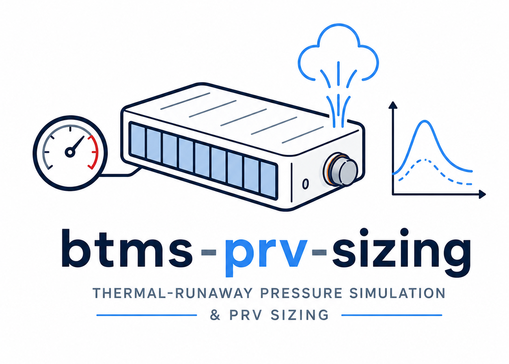
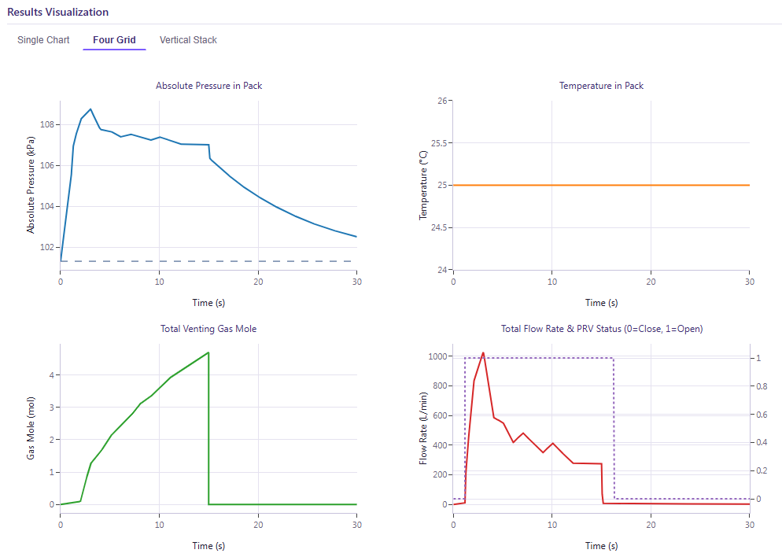
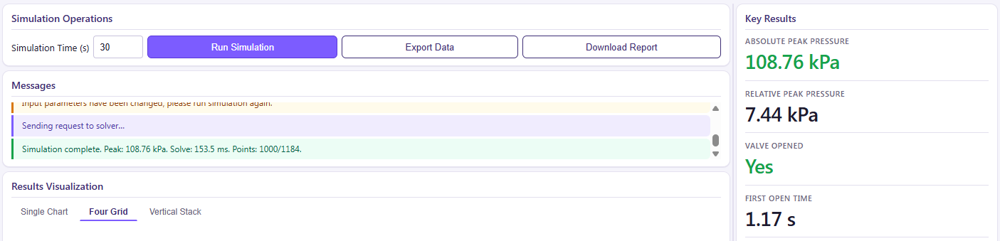
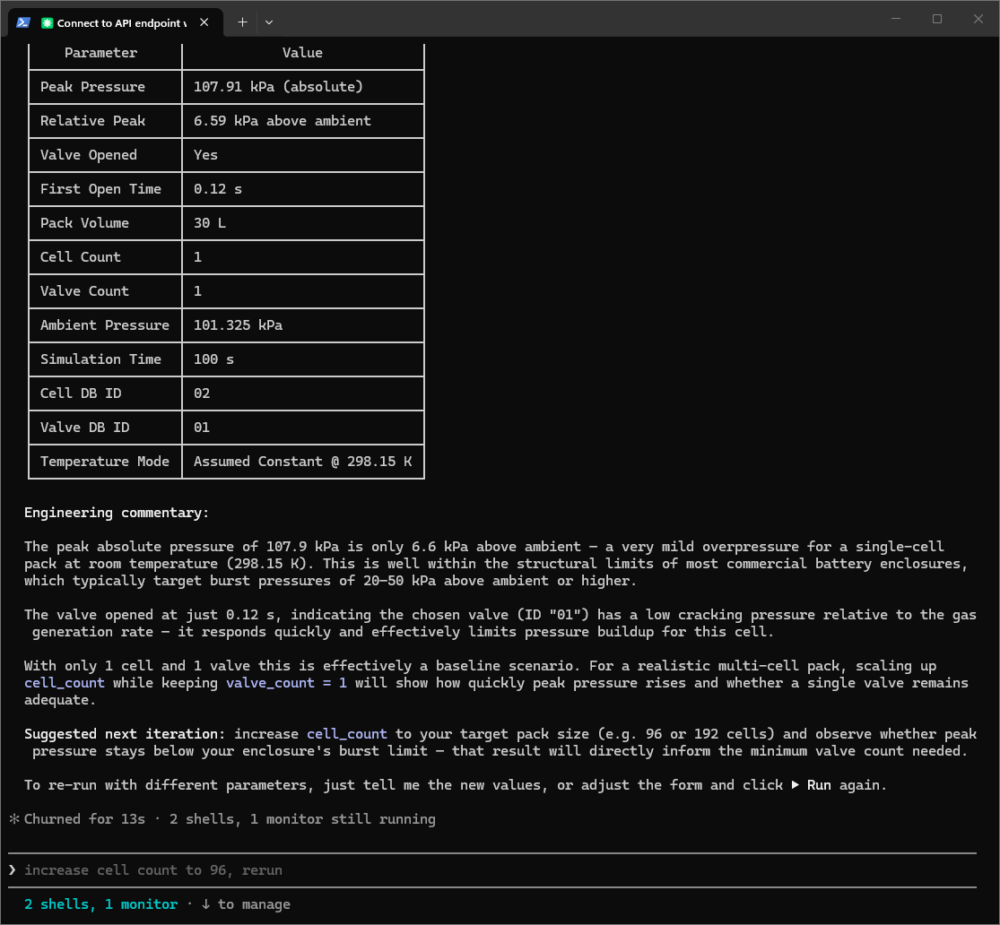
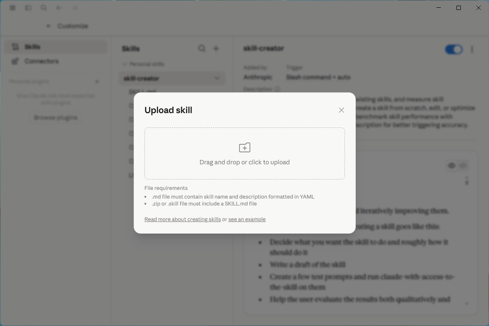
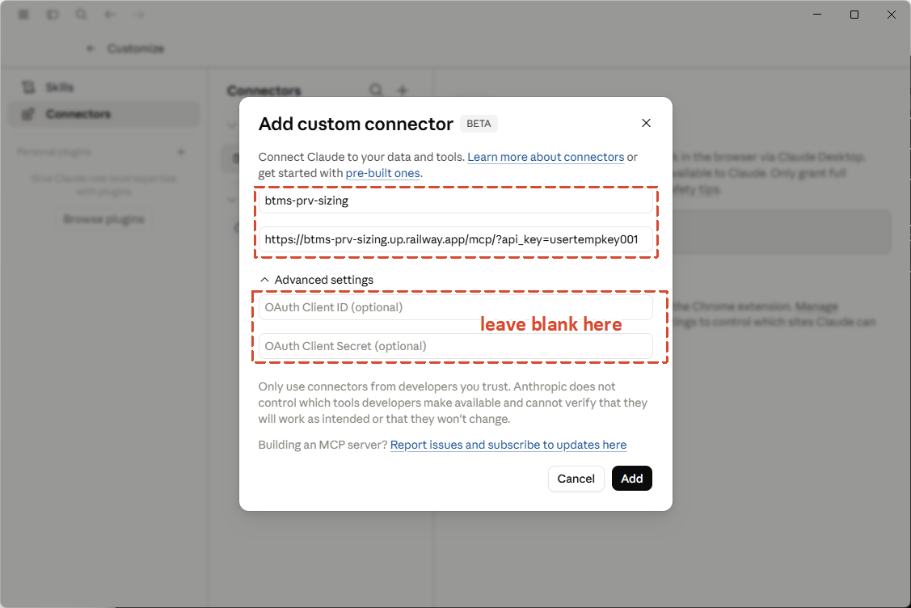

<div align="right">
  <a href="README.md">English</a> · <strong>简体中文</strong>
</div>

<h1 align="center">btms-prv-sizing</h1>

<p align="center">
  <em>面向电池包的热失控压力仿真与泄压阀（PRV）选型工具。</em>
</p>

<p align="center">
  
  
  
  
</p>

<p align="center">
  <!-- TODO: hero screenshot — see references/img/hero.png -->
  
</p>

`btms-prv-sizing` 帮助电池热管理工程师**模拟热失控事件中电池包内压力的演化**，并**评估所选 PRV 阀是否满足设计要求**——支持浏览器 GUI、Claude Code skill 和远程 MCP connector 三种接入方式。

后端求解核心为**集总参数电池包压力 ODE 模型**，使用 SciPy 的 BDF 求解器，输入为单电芯排气曲线与阀门压力-流量曲线的表格化数据。三种前端共用同一套后端。

---

## 目录

1. [项目简介](#1-项目简介)
2. [⚠️ DEMO 数据声明](#2--demo-数据声明)
3. [按用户类型快速开始](#3-按用户类型快速开始)
4. [浏览器 GUI（零安装）](#4-浏览器-gui零安装)
5. [Claude Code Skill](#5-claude-code-skill)
6. [Claude Desktop 与 claude.ai](#6-claude-desktop-与-claudeai)
7. [REST API 参考](#7-rest-api-参考)
8. [自定义数据（BYO）](#8-自定义数据byo)
9. [获取 API Key](#9-获取-api-key)
10. [系统架构](#10-系统架构)
11. [仓库结构](#11-仓库结构)
12. [故障排查](#12-故障排查)
13. [FAQ](#13-faq)
14. [贡献指南](#14-贡献指南)
15. [许可证](#15-许可证)
16. [联系方式](#16-联系方式)

---

## 1. 项目简介

锂电池单体一旦发生热失控，会向电池包内喷射高温气体。如果电池包来不及泄压，可能引发结构形变、向相邻电芯传播甚至外壳破裂等连锁后果。**PRV（泄压阀）选型**就是工程师根据最坏情况下的排气场景，选择合适的阀门——开启压力、流量能力、数量——使得电池包内峰值压力始终安全地低于结构耐压极限。

本项目提供：

- **网页 GUI**：交互式探索（Plotly 图表、CSV/PDF 导出）。
- **Claude Code skill**：自动驱动 GUI、监听结果、并直接在对话中输出工程分析报告。
- **远程 MCP connector**：将求解器作为工具暴露给 Claude Desktop、claude.ai 以及任何兼容 MCP 的客户端。

**物理模型**：集总参数理想气体电池包体积，支持两类阀门：

| 阀门类型 | 行为 |
|---|---|
| **Spring（弹簧式）** | 可逆。在 `p_open` 开启，在 `p_open − hysteresis`（开启相对压差的 5%，至少 500 Pa）回座。使用事件分段 BDF + `dn/dt` 回座闸控来抑制强排气下的颤振。 |
| **Membrane（膜片式）** | 不可逆。一旦穿越开启压力即锁死开启，之后整个仿真使用"开启后"曲线。 |

**适用场景**：早期 PRV 概念选型、敏感性分析（多加几个阀？提高开启压力？）以及由 Claude 驱动的"假设性"参数扫描。

**不适用场景**：最终合规性认证（请使用经验证的 CFD + 电芯实测数据）；或任何在未经独立验证的情况下危及人身或财产安全的决策。

---

## 2. ⚠️ DEMO 数据声明

> **本服务自带的电芯与阀门数据为 100% 虚构数据，仅供演示。** 它们既非实测、也非厂家提供、也未经任何物理实验验证。
>
> `GET /databases/*` 的每条响应中都带有 `data_notice: "DEMO_ONLY_FABRICATED – not for real design use"` 字段。请将自带的 ID 视为**占位符**，方便你端到端走通 API。
>
> **任何真实工程决策必须通过 [自定义数据 BYO 模式](#8-自定义数据byo) 提供你自己的实测数据。**

---

## 3. 按用户类型快速开始

| 如果你是… | 用… | 跳转到 |
|---|---|---|
| 👤 想点开网页就能用的工程师 | **浏览器 GUI** | [§4](#4-浏览器-gui零安装) |
| 💻 Claude Code（CLI / IDE）用户 | **Claude Code Skill** | [§5](#5-claude-code-skill) |
| 🖥️ Claude Desktop 用户 | **Skill 上传 + Connector** | [§6](#6-claude-desktop-与-claudeai) |
| 🌐 claude.ai Pro / Max / Team 用户 | **Skill 上传 + Connector** | [§6](#6-claude-desktop-与-claudeai) |
| 🛠️ 想集成进自己的流水线 | **REST API** | [§7](#7-rest-api-参考) |

五种路径**共用同一套后端 API 与同一把 API key**——选最适合你工作流的即可。

---

## 4. 浏览器 GUI（零安装）

最快上手的方式。**无需安装、无任何依赖、纯浏览器运行。**

> 🌐 **在线演示：** [thermalmaverick.github.io/btms-prv-sizing-skill](https://thermalmaverick.github.io/btms-prv-sizing-skill/)

<p align="center">
  <!-- TODO: screenshot — see references/img/gui-config.png -->
  
</p>

### 操作步骤

1. **在任意现代浏览器中打开链接**（Chrome、Edge、Firefox、Safari 均可）。
2. **在顶部配置栏填入连接信息**：
   - **API Endpoint** — `https://btms-prv-sizing.up.railway.app`
   - **X-API-Key** — 粘贴你的 key（见 [§9](#9-获取-api-key)，试用 key 为 `usertempkey001`）

   两个值都会自动存入浏览器 `localStorage`，下次访问自动预填。
3. **在左侧面板的两个下拉框中选择电芯和阀门**。列表通过 `GET /databases/cells` 与 `GET /databases/valves` 实时拉取。
4. **设置仿真参数**：电池包空隙体积、环境压力、电芯数量、阀门数量、仿真时长、温度模式。
5. **点击 ▶ Run**。每次求解大约 100-800 ms，四个 KPI 卡片（峰值压力、相对峰值、阀门是否开启、首次开启时间）会随图表面板一同更新。

### 图表（三种模式）

<p align="center">
  <!-- TODO: screenshot — see references/img/gui-charts.png -->
  
</p>

| 模式 | 内容 |
|---|---|
| **Single** | 一次只显示一条曲线——压力、温度、气体摩尔、阀门流量与状态 |
| **Grid (2×2)** | 四条曲线并排显示，一眼对照 |
| **Vstack** | 四条曲线垂直堆叠，共享 X 轴 |

### 导出

<p align="center">
  <!-- TODO: screenshot — see references/img/gui-export.png -->
  
</p>

- **CSV** — 完整时间序列数据（时间、压力、温度、摩尔数、阀门状态、流量）。
- **PDF** — 多页工程报告，包含 KPI 摘要、参数表与嵌入图表。服务端通过 ReportLab + Matplotlib 在线程池中生成。

---

## 5. Claude Code Skill

体验最完整的方式：Claude 自动开浏览器、监听每一次 ▶ Run、并直接在对话中写出工程分析报告。无需手动复制粘贴。

> 🛠️ **需要：** Claude Code CLI（终端或 IDE 扩展）。

<p align="center">
  <!-- TODO: screenshot — see references/img/claude-code-skill.png -->
  
</p>

### 安装

```bash
# Linux / macOS
git clone https://github.com/ThermalMaverick/btms-prv-sizing-skill \
          ~/.claude/skills/btms-prv-sizing
```

```powershell
# Windows
git clone https://github.com/ThermalMaverick/btms-prv-sizing-skill `
          "$env:USERPROFILE\.claude\skills\btms-prv-sizing"
```

> ⚠️ 目录结构必须精确。最终路径应为 `~/.claude/skills/btms-prv-sizing/SKILL.md`——不能嵌套，也不能改名。

### 触发方式

在任意对话中自然语言提问：

> "帮我给一个 30L 的电池包做 PRV 选型，1 个电芯热失控，仿真 60 秒。"

或显式调用：

```
/btms-prv-sizing
```

Claude 会：

1. 检测当前运行时（Claude Code CLI / Desktop / 网页版）。
2. 根据你的请求决定是开 GUI 还是直接调 MCP。
3. 如果走 GUI：询问你的 API endpoint + key + relay 端口，启动 relay，开浏览器，等你点 ▶ Run，然后把结果回写到对话。
4. 如果走 MCP：自动换算单位（L → m³、°C → K、kPa → Pa、min → s），构建参数确认表，等你确认后再调 `prv_solve`。

完整的路由逻辑见 [`SKILL.md`](SKILL.md)，详细步骤见 [`references/playbook.md`](references/playbook.md)。

### 可选：同时挂上 HTTP MCP

如果你希望 Claude Code 也能直接调 `prv_solve`（适合参数扫描），在项目根目录新建 `.mcp.json`：

```json
{
  "mcpServers": {
    "btms-prv-sizing": {
      "type": "http",
      "url": "https://btms-prv-sizing.up.railway.app/mcp/",
      "headers": { "X-API-Key": "usertempkey001" }
    }
  }
}
```

> `/mcp/` 末尾的斜杠必须保留——部分 MCP 客户端不会跟随 307 重定向。

---

## 6. Claude Desktop 与 claude.ai

自 2025 年第 4 季度的界面重新设计后，Claude Desktop 与 claude.ai 网页版**共用同一套 Customize 配置 UI**。下方说明适用于两者。

集成方式有**两种互补的方法**：

| | **方法 A — 上传为 Skill** | **方法 B — 添加为 Connector** |
|---|---|---|
| **获得的能力** | Claude 读取 `SKILL.md`，按 playbook 引导你（单位换算、参数确认表、分析模板） | 工具选择器中出现裸 MCP 工具（`prv_solve`、`prv_databases`、`prv_parameters`） |
| **Plan 要求** | **全部 plan** 支持（Free / Pro / Max / Team / Enterprise） | **仅 Pro / Max / Team / Enterprise**（Free 不支持） |
| **最佳场景** | "对话式引导我完成"体验 | "我已知参数，快速跑一次" |
| **GUI / 文件导出** | 不可用——Desktop 与 claude.ai 没有 shell | 不可用 |

> 💡 **最佳实践：两种方法都装。** Skill 提供 playbook 与歧义守门；Connector 提供 Skill 最终需要调用的求解工具。两者无缝协作。

### 6.1 前置条件

- **Claude Desktop：** 带 Customize 菜单的版本（2025-Q4 或更新）。
- **claude.ai：** Pro、Max、Team 或 Enterprise plan 账户（Free 无法添加自定义 Connector）。
- 一把 API key——见 [§9](#9-获取-api-key)。

### 6.2 方法 A — 上传为 Skill

<p align="center">
  <!-- TODO: screenshot — see references/img/claude-ai-customize-skills.png -->
  
</p>

1. **下载本仓库的 ZIP**（Code → Download ZIP），或从全新克隆生成：

   ```bash
   git clone https://github.com/ThermalMaverick/btms-prv-sizing-skill
   cd btms-prv-sizing-skill
   zip -r btms-prv-sizing.zip . -x ".git/*"
   ```

   ZIP 根目录**必须**包含顶层的 `SKILL.md`。如果你的压缩工具把所有内容嵌套进了 `btms-prv-sizing-skill/` 子目录，请进入该子目录后重新打包。

2. **在 Claude Desktop 或 claude.ai 中**，点击头像 → **Customize → Skills**。
3. 点击 **+ Create skill → Upload a skill**，选中 ZIP 文件。
4. Skill 出现在列表中——切换为**启用**状态。

至此完成。开启新对话，说 "帮我做个 PRV 选型"，Claude 就会按 `SKILL.md` 的 playbook 引导你。

### 6.3 方法 B — 添加为 Connector

<p align="center">
  <!-- TODO: screenshot — see references/img/claude-ai-customize-connectors.png -->
  
</p>

#### Pro / Max plan（按用户配置）

1. 点击头像 → **Customize → Connectors**。
2. 点击 **+** → **Add custom connector**。
3. 填入：
   - **Server URL：** `https://btms-prv-sizing.up.railway.app/mcp/`
     （末尾斜杠必填）
   - **Custom headers：** `X-API-Key: usertempkey001`
4. 点击 **Save**。
5. 验证：开启新对话 → 点左下角 **+** → **Connectors**。把 `btms-prv-sizing` 切换为启用，三个工具（`prv_solve`、`prv_databases`、`prv_parameters`）即可使用。

#### Team / Enterprise plan（组织级配置）

1. 由 **Owner** 打开 **Organization Settings → Connectors → Add → Custom → Web**。
2. 填入相同的 URL 与 Header，发布。
3. 各成员再按上面的 Pro/Max 步骤独立连接。

### 6.4 推荐组合

**两种方法一起安装**：

- **Skill** 加载 `SKILL.md`，提供对话式 playbook——单位换算、参数确认表、工程分析模板。
- **Connector** 暴露 Skill 实际调用的 `prv_solve` 工具。

不装 Connector，Skill 无法实际求解（它本身不带求解器）；不装 Skill，你拿到的只是裸工具，没有引导。

### 6.5 Desktop / claude.ai 的限制

这两个环境都没有 shell 访问与可写本地文件系统，因此：

- ❌ **无交互式 GUI / Plotly 图表。** 结果以 Markdown 表格返回。
- ❌ **无 CSV / PDF 下载。** `/report` 端点无法在这些客户端中以二进制 PDF 附件返回。
- ❌ **无本地 relay。** 依赖 `local_relay.py` 的 Skill 路径会自动禁用（Skill 检测到 `runtime = "headless"`）。

如果你需要以上任一功能，请回到 **[§4 浏览器 GUI](#4-浏览器-gui零安装)** 或 **[§5 Claude Code Skill](#5-claude-code-skill)**。

---

## 7. REST API 参考

> 🔌 **Base URL：** `https://btms-prv-sizing.up.railway.app`
> 🔑 **鉴权：** 除 `/health`、`/ready`、`/local-result-schema` 外，所有端点都需要 `X-API-Key` 请求头（例如 `X-API-Key: usertempkey001`）。

### 端点列表

| 方法 | 路径 | 鉴权 | 用途 |
|---|---|---|---|
| `GET` | `/health` | — | 存活检查（进程是否在跑） |
| `GET` | `/ready` | — | 就绪检查（数据库已加载、MCP 状态） |
| `GET` | `/parameters` | ✓ | 求解器输入 schema：SI 边界、默认值、显示单位 |
| `GET` | `/local-result-schema` | — | `last_result.json` 的 JSON Schema（relay → Claude 契约） |
| `GET` | `/databases/cells` | ✓ | 列出内置电芯条目（含完整排气曲线） |
| `GET` | `/databases/valves` | ✓ | 列出内置阀门条目（含完整 P-Q 曲线） |
| `POST` | `/solve` | ✓ | 跑一次仿真，返回 KPI + 降采样的时间序列 |
| `POST` | `/report` | ✓ | 跑一次仿真，返回多页 PDF 报告 |
| `POST` | `/mcp/` | ✓ | Streamable-HTTP 的 MCP 端点（供 connector 用） |

### `POST /solve` 最小示例

```bash
curl -X POST https://btms-prv-sizing.up.railway.app/solve \
  -H "X-API-Key: usertempkey001" \
  -H "Content-Type: application/json" \
  -d '{
    "v_pack":      0.030,
    "p_atm":       101325,
    "t_max":       60,
    "t_const":     298.15,
    "cell_count":  1,
    "valve_count": 1,
    "cell_db_id":  "01",
    "valve_db_id": "01"
  }'
```

响应（节选）：

```json
{
  "status": "success",
  "kpi": {
    "peak_pressure_kpa":           108.76,
    "relative_peak_pressure_kpa":   7.44,
    "valve_opened":                true,
    "first_open_time_s":            3.21
  },
  "timeseries": {
    "time_s":            [0.0, 0.06, ...],
    "pressure_kpa":      [101.325, 101.41, ...],
    "temperature_k":     [298.15, 298.15, ...],
    "molar_amount_mol":  [0.0, 0.003, ...],
    "valve_status":      [0, 0, ..., 1, 1, ...],
    "flow_rate_m3s":     [0.0, 0.0, ..., 5.4e-5, ...]
  },
  "meta": {
    "solver_points":      4321,
    "returned_points":    1000,
    "solve_time_ms":      87.4,
    "cell_db_id":         "01",
    "valve_db_id":        "01",
    "cell_source":        "database",
    "valve_source":       "database",
    "temperature_mode":   "Assumed Constant"
  }
}
```

### 限流

进程内令牌桶，默认 **每个 API key 60 次/分钟**。超出 → `429 Too Many Requests`，带 `Retry-After: 60` 头。自托管部署可通过 `RATE_LIMIT_RPM` 环境变量覆盖。

### 错误模型

| 状态码 | 含义 | detail 字段 |
|---|---|---|
| `401` | 缺 `X-API-Key` 请求头 | `"Missing X-API-Key header."` |
| `403` | Key 不在白名单 | `"Invalid API key."` |
| `422` | 输入校验失败（Pydantic 或 `SizingError`） | 字段级错误信息 |
| `429` | 触发限流 | `"Rate limit exceeded (60 requests / minute)."` |
| `500` | 内部求解器崩溃 | `"Internal solver error."`（完整堆栈仅记入服务端日志） |
| `503` | 服务端配置错误（`API_KEYS` 环境变量为空） | `"Server misconfigured: API_KEYS env var not set."` |

---

## 8. 自定义数据（BYO）

自带的电芯/阀门数据均为 demo 数据。真实设计工作中，请在同一个请求里提供你自己的排气曲线和/或阀门 P-Q 曲线。

电芯侧与阀门侧可以**各自独立**混用 DB 与 BYO——例如 demo 电芯 + 自定义阀门，或自定义电芯 + DB 阀门。

### 自定义电芯

```json
{
  "v_pack":      0.030,
  "t_max":       60,
  "cell_count":  1,
  "valve_count": 2,
  "valve_db_id": "01",
  "custom_cell": {
    "venting_curve": {
      "t_s":   [0.0, 1.0, 5.0, 10.0, 30.0, 60.0],
      "n_mol": [0.0, 0.05, 0.4,  1.2,  2.1,  2.4]
    }
  }
}
```

- `t_s` — 严格单调递增，≥ 0，单位秒。
- `n_mol` — **每个电芯**的累计排气摩尔数，单调不减，≥ 0。

### 自定义阀门

```json
{
  "v_pack":     0.030,
  "t_max":      60,
  "cell_db_id": "01",
  "custom_valve": {
    "valve_type":              "Spring",
    "opening_pressure_rel_pa": 5000,
    "pq_curve_before": {
      "dp_pa": [0, 1000, 5000, 10000],
      "q_m3s": [0, 1.0e-5, 5.0e-5, 1.0e-4]
    },
    "pq_curve_after": {
      "dp_pa": [0, 1000, 5000, 10000, 50000],
      "q_m3s": [0, 1.5e-4, 5.0e-4, 1.2e-3, 5.0e-3]
    }
  }
}
```

- `valve_type` — `"Spring"`（可逆）或 `"Membrane"`（锁死开启）。
- `opening_pressure_rel_pa` — 相对于环境的开启压力，0 < p ≤ 1 000 000 Pa。
- `pq_curve_before` — 阀关闭时的泄漏/开启前流量。
- `pq_curve_after` — 阀开启后的泄压流量。
- 两条曲线：`dp_pa` 严格递增 ≥ 0，`q_m3s` 单调不减 ≥ 0。

### 多阀说明

`valve_count = N` 表示**并联 N 个完全相同的阀门**（同类型、同 P-Q 曲线）。如需模拟异构组合（如 1 个 Spring + 1 个 Membrane），请分别跑两次仿真后对比。

---

## 9. 获取 API Key

试用评估直接用以下 key 即可，在线服务开箱可用：

```
usertempkey001
```

把它粘到 GUI 的 **X-API-Key** 字段，或 `.mcp.json` / Connector 配置的 `headers` 块。**无需注册。**

> 试用 key 限流 **60 RPM/key**，以保证在线后端对所有人都健康。如果你的使用持续触发限流，请提 GitHub issue 描述你的用例。

> ⚠️ **安全：** 不要把试用 key（或任何生产 key）提交到公开仓库。即使它是共享的试用凭证，泄露依然会让滥用变得轻而易举——请像对待密码一样对待它。

---

## 10. 系统架构

```
                       ┌─────────────────────────────────────┐
                       │             最终用户                  │
                       └─────────────────────────────────────┘
                                       │
       ┌───────────────────┬───────────┴────────────┬─────────────────────┐
       ▼                   ▼                        ▼                     ▼
  ┌──────────┐      ┌─────────────┐         ┌──────────────┐      ┌──────────────┐
  │ 浏览器    │      │ Claude Code │         │ Claude       │      │ 你的脚本     │
  │ (Pages)  │      │ Skill +     │         │ Desktop /    │      │ (curl /      │
  │          │      │ Relay       │         │ claude.ai    │      │  requests)   │
  └──────────┘      └─────────────┘         └──────────────┘      └──────────────┘
       │                   │                        │                     │
       │       每个请求都带 X-API-Key 请求头         │                     │
       └────────────────┬──┴──────────────┬─────────┴────────┬────────────┘
                        ▼                 ▼                  ▼
                ┌──────────────────────────────────────────────────┐
                │      FastAPI 服务（Railway 托管）                  │
                │                                                  │
                │   /solve · /report · /databases · /parameters    │
                │   /mcp/   (Streamable-HTTP FastMCP 子应用)        │
                └──────────────────────────────────────────────────┘
                                       │
                                       ▼
                ┌──────────────────────────────────────────────────┐
                │   BatteryPressureSolver  (core/solver.py)        │
                │   — SciPy BDF ODE 求解                            │
                │   — Spring（事件分段、迟滞 + dn/dt 回座闸控）       │
                │   — Membrane（终止锁死事件）                       │
                └──────────────────────────────────────────────────┘
```

后端代码在**私有仓库**；本 `skill/` 目录是公开的客户端 + skill 包。

---

## 11. 仓库结构

```
btms-prv-sizing-skill/                     ← 你现在的位置
├── README.md                              ← 英文版（主页）
├── README.zh-CN.md                        ← 简体中文（本文件）
├── LICENSE                                ← PolyForm Noncommercial 1.0.0
├── SKILL.md                               ← 运行手册（Claude 会读取）
├── index.html                             ← GitHub Pages 跳转 → scripts/btms_prv_sizing_app.html
├── references/                            ← 详细操作步骤（Claude 按需读取）
│   ├── playbook.md                        ← MCP / Browser / HTTP 后备路径 + 分析模板
│   ├── troubleshooting.md                 ← 运行期故障矩阵
│   └── img/                               ← README 中引用的截图
└── scripts/
    ├── btms_prv_sizing_app.html           ← GUI（Plotly + 原生 JS，单文件）
    ├── local_relay.py                     ← 本地 HTTP relay：托管 HTML、接收结果
    └── watch_results.py                   ← 长驻 watcher：把浏览器结果流向 Claude
```

**求解核心**（`core/solver.py`、电芯/阀门数据库、PDF 报告生成）位于**独立的私有仓库**，未在此分发。

---

## 12. 故障排查

| 症状 | 可能原因 | 解决方法 |
|---|---|---|
| 页面加载完成，但下拉框一直显示 "Loading…" | API endpoint 错误或后端宕机 | 验证 `curl <endpoint>/health` 返回 `{"status":"ok"}` |
| `403 Invalid API key` | Key 错误或带有空白字符 | 重新复制 key；不要带引号 |
| Connector 报 `401 Missing X-API-Key header` | Connector 中没配 header | 重新编辑 Connector，确保 **Custom headers** 含 `X-API-Key: …` |
| Skill 上传报 "Missing required Skill.md file" | ZIP 多套了一层目录 | 进入项目目录**内部**重新打包 |
| Skill 上传报 "ZIP file exceeds size limits" | 不小心把 `.git/` 或 `node_modules/` 打进去了 | 用 `zip -r out.zip . -x ".git/*"` 重新打包 |
| Connector 添加报 "Server URL must be HTTPS" | URL 没有 scheme 或用了 HTTP | 使用完整 `https://…/mcp/`，末尾斜杠必填 |
| Connector 添加报 "Invalid Host header" / 421 | 后端 `MCP_ALLOWED_HOSTS` 环境变量没加你的域名 | 自托管：自行配置；公开服务：提 issue |
| Claude Code 中 `/btms-prv-sizing` 触发不了 | 安装路径错了 | 目录必须为 `~/.claude/skills/btms-prv-sizing/SKILL.md` |
| 本地 relay 报 `WinError 10013` | Windows 保留端口段（Hyper-V/WSL2 机器上 7950–8149） | `RELAY_PORT=9080` 或保留段以外的任意端口 |
| `429 Rate limit exceeded` | 触发了 60 RPM/key 限流 | 等 60 秒；如需批量调用，请提 issue |
| `500 Internal solver error.` | 求解器崩溃，详情仅在服务端日志中 | 提 issue 并附触发的请求 body |

Claude 会话内的常见 gotcha 见 [`references/troubleshooting.md`](references/troubleshooting.md)。

---

## 13. FAQ

<details>
<summary><strong>为什么自带的电芯和阀门数据是虚构的？</strong></summary>

电芯排气曲线和阀门 P-Q 特性在几乎所有商业关系中都受 NDA 保护。我们提供虚构的 DEMO 数据，是为了让任何人都能在无需谈判数据授权的前提下端到端跑通 API——你被预期在真实工程中通过 [BYO](#8-自定义数据byo) 接入自己的实测曲线。

</details>

<details>
<summary><strong>能自托管后端吗？</strong></summary>

求解核心（`core/solver.py`、FastAPI 应用、电芯/阀门加载器）目前位于私有仓库，**暂不开放自托管**。如果这是你评估时的卡点，请提 issue 描述用例。

</details>

<details>
<summary><strong>我的请求内容会被存储吗？</strong></summary>

公开在线服务会记录请求元数据（API key 指纹、路径、状态码、延迟），但**不会**持久化请求 body 或响应 body。PDF 生成流水线全程在内存中完成。

如果你的数据敏感到连临时日志都不能接受，请把所有东西放本地：在 Claude Code 中使用 Skill + `local_relay.py` + 自托管后端。

</details>

<details>
<summary><strong>能在同一个电池包上模拟多个不同型号的阀门吗？</strong></summary>

单次请求不行。`valve_count = N` 模拟的是 N 个**完全相同**的并联阀。如需异构安装，请按阀型分别仿真，再对比 KPI。

</details>

<details>
<summary><strong>求解器支持稳态吗？</strong></summary>

不支持——模型纯粹是瞬态的（`t_max ≤ 600 s`）。持续泄漏下的稳态压力不在本工具范围内。

</details>

<details>
<summary><strong>为什么 `t_max` 上限是 600 秒？</strong></summary>

集总参数假设（内部气体均匀、无温度梯度）在很长事件中会失效；过长的仿真也会让单次求解时间超出交互式对话的承受范围。如确需更长事件，请提 issue。

</details>

<details>
<summary><strong>GUI vs Skill — 什么时候用哪个？</strong></summary>

- **浏览器 GUI** — 探索性、可视、迭代式；可导出 PDF。
- **Claude Code Skill** — 对话式、自动解歧、自动换算单位；也能反过来驱动 GUI。
- **MCP Connector（Desktop / claude.ai）** — 已知参数时的快速参数扫描。

可以组合使用：Skill 内部调用的就是同一个后端。

</details>

---

## 14. 贡献指南

本仓库是已发布的产物，并非开发上游：

- ✅ **HTML GUI、`SKILL.md`、relay 的 Bug 报告**欢迎提交。请附浏览器/操作系统/Claude 客户端版本。
- ✅ **文档修正**（错别字、失效链接、表述不清）——欢迎 PR。
- ⚠️ **新功能 PR**——请在动手前先开 issue 讨论变更范围。范围蔓延是 PR 被拒的主要原因。

本仓库不含 CI（求解核心的测试位于私有后端仓库）。

---

## 15. 许可证

[PolyForm Noncommercial 1.0.0](LICENSE) — 个人、研究、学术、评估目的下可免费使用。**商业使用必须从版权所有人获得单独许可**。完整法律文本见 `LICENSE`。

版权所有 © 2026 Thermal Maverick。

---

## 16. 联系方式

- **Bug 报告与功能需求** — 请用 [GitHub Issues](https://github.com/ThermalMaverick/btms-prv-sizing-skill/issues)。
- **商业授权咨询** — 提 GitHub issue 并打 `[license]` 标签，我们会转到线下沟通。

---

<p align="center">
  <sub>基于 FastAPI · SciPy · Plotly · ReportLab · Claude Skills 构建。</sub>
</p>
